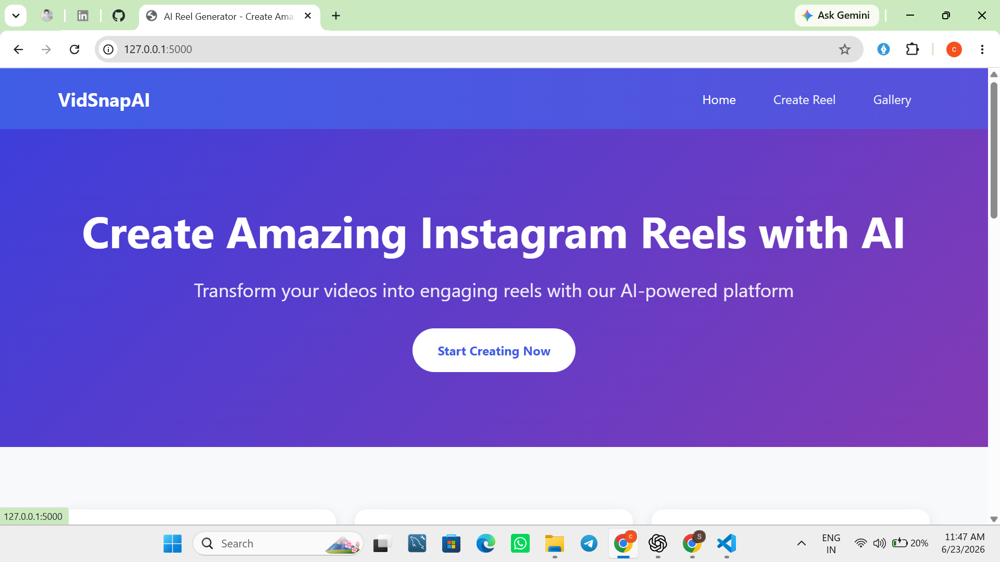
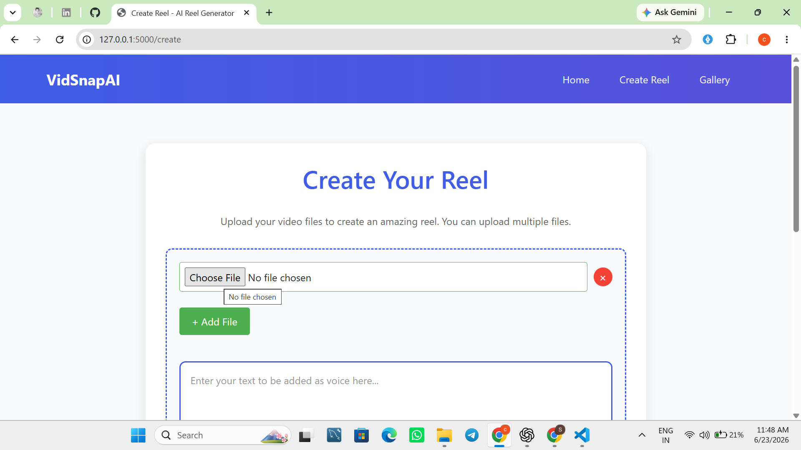
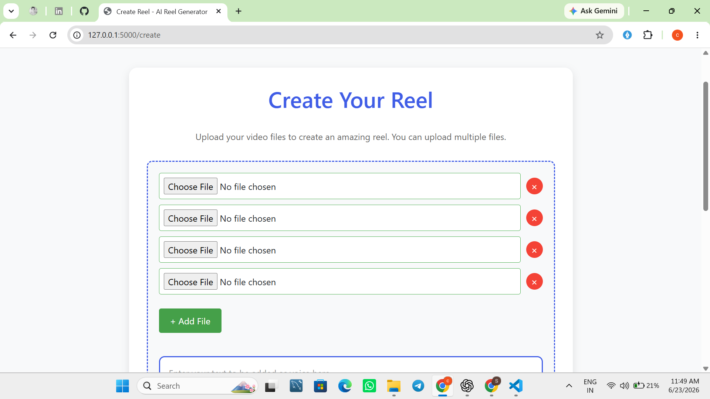
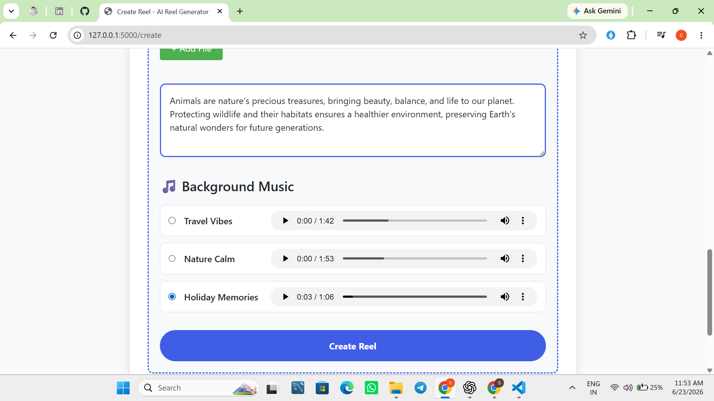
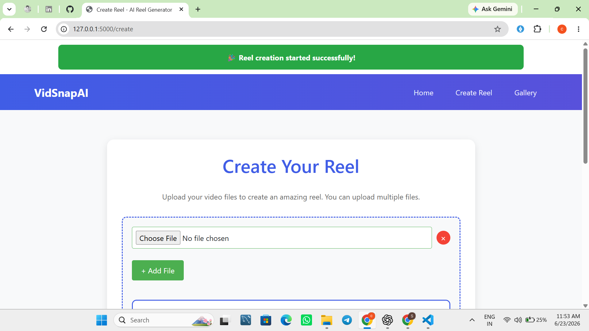
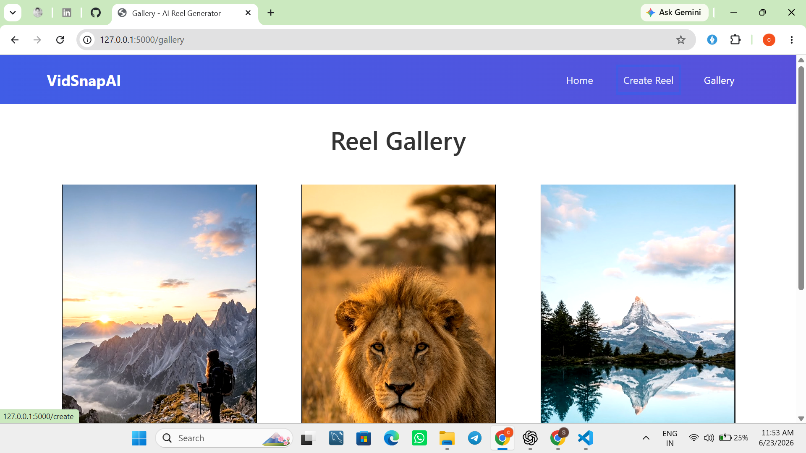
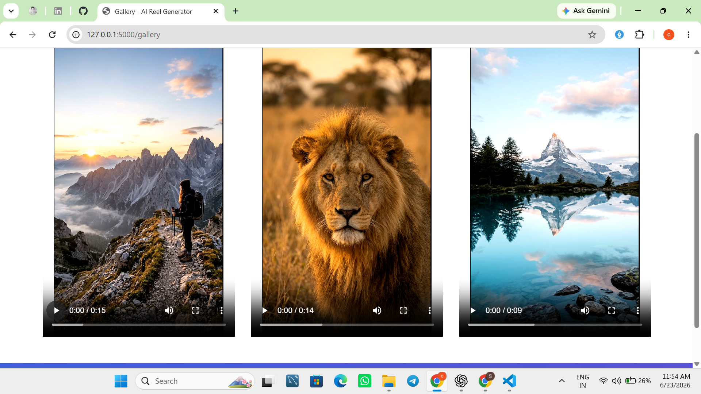

# 🎬 VidSnapAI - AI Reel Generator

VidSnapAI is a Flask-based web application that automatically creates Instagram-style reels from uploaded images and text.

Users can:
- Upload multiple images
- Enter text for AI voice narration
- Select background music
- Automatically generate vertical reels (1080x1920)
- View generated reels in a gallery

---

## 🚀 Features

✅ Upload multiple images

✅ Text-to-Speech voice generation

✅ Background music selection

✅ Automatic reel creation using FFmpeg

✅ Instagram Reel format (1080×1920)

✅ Reel gallery page

✅ Flash notifications

✅ Responsive UI

---

## 🛠️ Technologies Used

- Python
- Flask
- HTML5
- CSS3
- JavaScript
- FFmpeg
- UUID
- File Handling
- Jinja2 Templates

---

## 📂 Project Structure

```text
VidSnapAI/
│
├── static/
│   ├── css/
│   │   ├── style.css
│   │   ├── create.css
│   │   └── gallery.css
│   │
│   ├── reels/
│   └── songs/
│
├── templates/
│   ├── base.html
│   ├── index.html
│   ├── create.html
│   └── gallery.html
│
├── user_uploads/
│
├── main.py
├── generate_process.py
├── text_to_audio.py
├── config.py
├── done.txt
└── sample_input_ffmpeg.txt
```

---

## ⚙️ How It Works

### Step 1

Upload images.

### Step 2

Enter text description.

### Step 3

Choose background music.

### Step 4

The application:

- Saves uploaded images
- Generates narration audio
- Creates FFmpeg input file
- Mixes narration and background music
- Generates reel automatically

### Step 5

Generated reel appears in the Gallery page.

---

## 📸 Screenshots

### Home Page



---

### Features Section


---

### Create Reel Page



---

### Upload Images



---

### Text and Music Selection



---

### Reel Creation Started



---

### Gallery Page



---

### Generated Reels



---

## 🔧 Installation

### Clone Repository

```bash
git clone https://github.com/your-username/VidSnapAI.git
```

### Move Into Project

```bash
cd VidSnapAI
```

### Install Dependencies

```bash
pip install flask
```

### Install FFmpeg

Download and install FFmpeg:

https://ffmpeg.org/download.html

Add FFmpeg to system PATH.

---

## ▶️ Run Application

### Start Flask App

```bash
python main.py
```

### Start Background Processor

Open another terminal:

```bash
python generate_process.py
```

---

## 📌 Future Improvements

- User authentication
- AI image generation
- Multiple voice options
- Video upload support
- Reel download button
- Progress bar during generation
- Cloud storage integration

---

## 👨‍💻 Author

Smit Chauhan

MSc IT Student

Python | Flask | Data Science Enthusiast

---

## ⭐ Support

If you like this project, consider giving it a Star ⭐ on GitHub.
